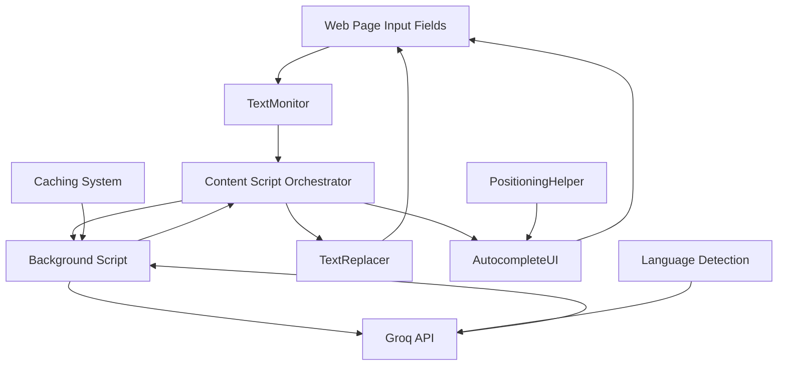

# Design Document

## Overview

The Content Script Text Correction & Autocomplete UI system is designed to provide seamless, real-time text improvement directly within web page input fields. This system builds upon the existing Chrome extension architecture to deliver inline grammar corrections and autocomplete suggestions while preserving user language and maintaining typing flow.

The design leverages the existing TextMonitor, TextReplacer, TextUI, and PositioningHelper modules while enhancing them to support direct input field manipulation instead of popup-based interactions.

## Architecture

### High-Level Architecture



### Component Interaction Flow

1. **Input Detection**: TextMonitor detects typing in supported input fields
2. **Debounced Processing**: Content script waits for typing pause (500ms)
3. **Background Processing**: Text sent to background script for API processing
4. **Language-Aware Correction**: Groq API processes text while preserving original language
5. **Seamless Replacement**: TextReplacer applies corrections without disrupting cursor
6. **Autocomplete Display**: Ghost text or inline suggestions shown for completion
7. **User Interaction**: Tab/click to accept, Escape to dismiss

## Components and Interfaces

### Enhanced TextMonitor

**Purpose**: Monitor all supported input types with improved selector coverage

**Key Enhancements**:

- Expanded selector list including rich text editors
- Dynamic element detection for SPA compatibility
- Security filtering to exclude password fields
- Debounced event handling to prevent excessive API calls

**Interface**:

```javascript
class TextMonitor {
  getTextInputSelectors(): string[]
  attachListeners(element: HTMLElement): void
  processInput(element: HTMLElement, elementId: string): void
  setUIHandler(uiHandler: TextUI): void
  getStats(): MonitorStats
}
```

### Enhanced TextReplacer

**Purpose**: Seamlessly replace text while preserving cursor position and user experience

**Key Features**:

- Cursor position preservation across all input types
- Undo stack management per element
- Diff-based replacement for minimal disruption
- Animation support for visual feedback

**Interface**:

```javascript
class TextReplacer {
  replaceText(element: HTMLElement, newText: string, options: ReplaceOptions): boolean
  insertTextAtCursor(element: HTMLElement, text: string): void
  replaceWordAtCursor(element: HTMLElement, newWord: string): boolean
  undo(element: HTMLElement): boolean
  getSelection(element: HTMLElement): Selection
  setSelection(element: HTMLElement, selection: Selection): void
}
```

### AutocompleteUI Component

**Purpose**: Display and manage autocomplete suggestions as ghost text or inline overlays

**Key Features**:

- IDE-style ghost text rendering
- Precise positioning using PositioningHelper
- Keyboard navigation (Tab to accept, Escape to dismiss)
- Click-to-accept functionality
- Multi-suggestion cycling support

**Interface**:

```javascript
class AutocompleteUI {
  displayGhostText(element: HTMLElement, suggestion: string, partialWord: string): void
  displayInlineOverlay(element: HTMLElement, suggestions: string[]): void
  acceptSuggestion(element: HTMLElement): void
  dismissSuggestions(element: HTMLElement): void
  cycleSuggestions(element: HTMLElement, direction: 'next' | 'prev'): void
}
```

### Enhanced TextUI Orchestrator

**Purpose**: Coordinate all text correction and autocomplete functionality

**Key Responsibilities**:

- Sequential processing pipeline (grammar → autocomplete → completion)
- Language consistency management
- Rate limiting and caching coordination
- Visual feedback and notifications
- Settings management

**Interface**:

```javascript
class TextUI {
  handleTextInput(element: HTMLElement, inputData: InputData): void
  processTextForUI(element: HTMLElement, inputData: InputData): Promise<void>
  requestAutomaticGrammarCorrection(element: HTMLElement, text: string): Promise<void>
  displayAutocompleteSuggestions(element: HTMLElement, suggestions: SuggestionData): void
  updateSettings(settings: UISettings): void
}
```

### Language Detection Service

**Purpose**: Ensure consistent language detection and preservation throughout the correction process

**Key Features**:

- Universal language support (Russian, Spanish, French, Chinese, etc.)
- Session-based language consistency
- Fallback mechanisms for uncertain detection
- Caching to avoid repeated detection

**Interface**:

```javascript
class LanguageDetectionService {
  detectLanguage(text: string): string
  getSessionLanguage(elementId: string): string
  setSessionLanguage(elementId: string, language: string): void
  isLanguageConsistent(text: string, expectedLanguage: string): boolean
}
```

## Data Models

### InputData Model

```javascript
interface InputData {
  elementId: string
  textContent: string
  caretPosition: { start: number, end: number }
  timestamp: number
  elementType: string
  elementAttributes: ElementAttributes
}
```

### CorrectionResult Model

```javascript
interface CorrectionResult {
  corrected: string
  original: string
  hasChanges: boolean
  detectedLanguage: string
  sentenceCount: number
  model: string
  timestamp: number
}
```

### SuggestionData Model

```javascript
interface SuggestionData {
  suggestions: string[]
  original: string
  context: string
  detectedLanguage: string
  partialWord?: string
  model: string
  timestamp: number
}
```

### UISettings Model

```javascript
interface UISettings {
  showGrammarCorrections: boolean
  showAutocomplete: boolean
  showHighlighting: boolean
  debounceDelay: number
  maxSuggestions: number
  autoAcceptDelay: number
}
```

## Error Handling

### Graceful Degradation Strategy

1. **API Failures**: Continue operation without corrections, cache failures for retry
2. **Network Issues**: Implement exponential backoff with maximum retry limits
3. **Element Detection Failures**: Log warnings but continue monitoring other elements
4. **Cursor Position Errors**: Fall back to end-of-text positioning
5. **Language Detection Failures**: Default to English with user notification option

### Error Recovery Mechanisms

```javascript
class ErrorHandler {
  handleAPIError(error: APIError, context: string): void
  handleElementError(error: ElementError, element: HTMLElement): void
  handleNetworkError(error: NetworkError): void
  retryWithBackoff(operation: Function, maxRetries: number): Promise<any>
}
```

### Logging and Monitoring

- Console logging for development debugging
- Error categorization and counting
- Performance metrics tracking
- User action analytics (anonymous)

## Testing Strategy

### Unit Testing Approach

1. **TextMonitor Tests**:

   - Selector matching accuracy
   - Event handling and debouncing
   - Dynamic element detection
   - Security filtering validation

2. **TextReplacer Tests**:

   - Cursor position preservation
   - Text replacement accuracy
   - Undo functionality
   - Cross-browser compatibility

3. **AutocompleteUI Tests**:

   - Ghost text positioning
   - Keyboard interaction handling
   - Visual rendering accuracy
   - Performance under load

4. **Integration Tests**:
   - End-to-end correction workflow
   - Multi-language text processing
   - Complex website compatibility
   - Error handling scenarios

### Browser Compatibility Testing

- Chrome (primary target)
- Edge (Chromium-based)
- Firefox (future consideration)
- Mobile Chrome (responsive design)

### Website Compatibility Testing

Priority websites for testing:

- Gmail (rich text editor)
- LinkedIn (professional writing)
- Twitter (social media)
- Notion (collaborative editing)
- Google Docs (complex editor)
- GitHub (code comments)
- Stack Overflow (technical writing)

## Performance Considerations

### Optimization Strategies

1. **Debouncing**: 500ms delay to prevent excessive API calls during rapid typing
2. **Caching**: Multi-level caching (sentence-level, full-text, autocomplete)
3. **Rate Limiting**: 3-second delay for last sentence corrections
4. **Lazy Loading**: Initialize components only when needed
5. **Memory Management**: Automatic cleanup of old cache entries and event listeners

### Resource Usage Targets

- **Memory**: < 50MB total extension memory usage
- **CPU**: < 5% CPU usage during active typing
- **Network**: < 100 API calls per hour per user
- **Storage**: < 10MB local storage for caching

### Performance Monitoring

```javascript
class PerformanceMonitor {
  trackAPILatency(operation: string, duration: number): void
  trackMemoryUsage(): MemoryStats
  trackCacheHitRate(): CacheStats
  generatePerformanceReport(): PerformanceReport
}
```

## Security Considerations

### Data Protection

1. **Password Field Exclusion**: Strict filtering to never monitor password inputs
2. **Sensitive Data Detection**: Avoid processing credit card numbers, SSNs, etc.
3. **Local Processing**: Minimize data sent to external APIs
4. **Cache Encryption**: Encrypt cached corrections containing sensitive text
5. **User Consent**: Clear privacy policy and opt-in mechanisms

### API Security

1. **Key Management**: Secure storage of API credentials
2. **Request Sanitization**: Clean input before sending to API
3. **Response Validation**: Validate API responses before applying corrections
4. **Rate Limiting**: Prevent abuse and excessive usage
5. **Error Information**: Avoid exposing sensitive error details

### Content Security Policy

```javascript
// Manifest V3 CSP considerations
const securityPolicy = {
  content_security_policy: {
    extension_pages: "script-src 'self'; object-src 'self'",
  },
  permissions: ['activeTab', 'storage', 'background'],
  host_permissions: ['https://*/*'],
};
```

## Accessibility Compliance

### WCAG 2.1 AA Compliance

1. **Keyboard Navigation**: Full keyboard accessibility for all UI elements
2. **Screen Reader Support**: ARIA labels and descriptions for autocomplete suggestions
3. **Visual Indicators**: High contrast highlighting for corrections
4. **Focus Management**: Proper focus handling during text replacement
5. **User Control**: Easy disable/enable options for all features

### Assistive Technology Support

```javascript
class AccessibilityHelper {
  announceCorrection(originalText: string, correctedText: string): void
  announceAutocomplete(suggestion: string): void
  setARIALabels(element: HTMLElement, labels: ARIALabels): void
  manageFocus(element: HTMLElement, operation: string): void
}
```

## Internationalization Support

### Multi-Language Architecture

1. **Universal Language Detection**: Support for 20+ languages including RTL languages
2. **Language-Specific Processing**: Tailored grammar rules per language
3. **Cultural Adaptation**: Respect regional writing conventions
4. **Fallback Mechanisms**: Graceful handling of unsupported languages

### Supported Languages (Phase 1)

- English (primary)
- Spanish
- French
- German
- Italian
- Portuguese
- Russian
- Chinese (Simplified)
- Japanese
- Korean

### Language Processing Pipeline

```javascript
class LanguageProcessor {
  detectLanguage(text: string): LanguageResult
  validateLanguageConsistency(text: string, expectedLang: string): boolean
  getLanguageSpecificRules(language: string): GrammarRules
  processTextInLanguage(text: string, language: string): ProcessingResult
}
```

This design provides a comprehensive foundation for implementing the content script text correction and autocomplete UI system while maintaining compatibility with the existing codebase and ensuring scalability for future enhancements.
