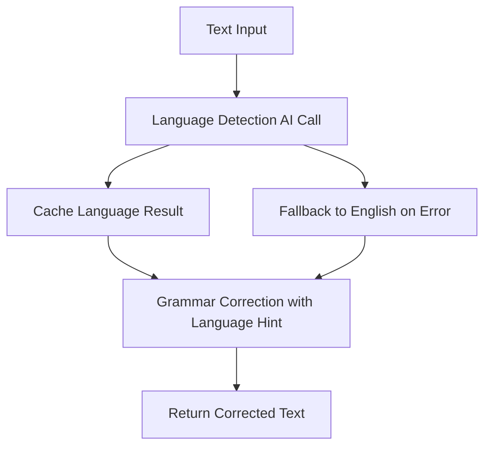

# Improved Language Detection for Grammar Correction - Design Document

## Overview

This design implements a simplified two-step approach to language detection and grammar correction. The current system uses complex multilingual prompts that cause unwanted translations. The new design separates language detection into a dedicated AI call, then uses simple prompt instructions to ensure grammar correction stays in the original language.

## Architecture

### Current System Issues

- Complex multilingual prompts in `correctSingleSentence()` cause translation sensitivity
- Language detection using regex patterns is unreliable for mixed content
- Grammar correction prompt tries to handle both language detection and correction simultaneously

### New Two-Step Architecture

1. **Language Detection AI Call**: Separate, lightweight AI call to detect language
2. **Simplified Grammar Correction**: Use detected language as hint with simple "same language" instructions



## Components and Interfaces

### 1. Language Detection Service

**New Method: `detectLanguageWithAI(text)`**

```javascript
async detectLanguageWithAI(text) {
  // Simple AI call that returns only language name
  // Falls back to "english" on error
  // Caches results for performance
}
```

**Input**: Text string to analyze
**Output**: Single language name (e.g., "english", "spanish", "french")
**Caching**: Session-based language cache to avoid repeated calls

### 2. Modified Grammar Correction

**Updated Method: `correctSingleSentence(sentence, detectedLanguage)`**

- Remove complex multilingual prompt
- Add simple language preservation instructions
- Use detected language as hint, not strict requirement

### 3. Cache Management

**Language Cache**: New cache specifically for language detection results

- Key: Text hash or first 100 characters
- Value: Detected language + timestamp
- Expiry: Session-based (cleared on page reload)

## Data Models

### Language Detection Response

```javascript
{
  language: "english",        // Single word language name
  confidence: "high",         // Optional: high/medium/low
  timestamp: 1234567890,      // Cache timestamp
  source: "ai"               // "ai" or "fallback"
}
```

### Updated Grammar Correction Response

```javascript
{
  corrected: "corrected text",
  original: "original text",
  hasChanges: true,
  detectedLanguage: "english",  // From AI detection
  languageSource: "ai",         // "ai" or "fallback"
  sentenceCount: 2,
  model: "llama3-8b-8192",
  timestamp: 1234567890
}
```

## Error Handling

### Language Detection Failures

1. **Network Errors**: Fall back to "english", log error
2. **Invalid AI Response**: Parse response, extract language name, fall back to "english"
3. **Timeout**: 5-second timeout, fall back to "english"
4. **API Errors**: Log error, continue with "english"

### Grammar Correction Failures

- Continue with existing error handling
- Include language detection source in error logs

## Testing Strategy

### Unit Tests

1. **Language Detection AI Call**

   - Test with various languages
   - Test error handling and fallbacks
   - Test caching behavior

2. **Simplified Grammar Correction**

   - Test with AI-detected languages
   - Test with fallback language
   - Verify no unwanted translations

3. **Cache Management**
   - Test language cache storage/retrieval
   - Test cache expiry
   - Test cache size limits

### Integration Tests

1. **End-to-End Flow**

   - Text input → Language detection → Grammar correction
   - Test with mixed language content
   - Test with edge cases (very short text, special characters)

2. **Performance Tests**
   - Measure impact of additional AI call
   - Test cache effectiveness
   - Test timeout handling

### Manual Testing

1. **Language Accuracy**

   - Test with native speakers of different languages
   - Verify no unwanted translations
   - Test with code-switching (mixed languages)

2. **User Experience**
   - Test typing flow with new system
   - Verify performance is acceptable
   - Test error scenarios

## Implementation Details

### Language Detection Prompt

```
You are a language detection assistant. Analyze the text and return ONLY the language name as a single word.

Examples:
- "Hello world" → english
- "Hola mundo" → spanish
- "Bonjour monde" → french

Return only the language name, nothing else.
```

### Simplified Grammar Correction Prompt

```
You are a grammar correction assistant. Your task is to:
1. Correct grammar, spelling, and punctuation errors
2. CRITICAL: Respond in the SAME language as the input text
3. DO NOT translate - keep the original language
4. Return ONLY the corrected text

Language hint (may be incorrect): ${detectedLanguage}
Trust your own language understanding over this hint.
```

### Cache Implementation

- **Language Cache**: Map with text hash as key
- **Size Limit**: 100 entries, LRU eviction
- **Expiry**: Session-based (no persistent storage)
- **Performance**: O(1) lookup, minimal memory impact

### Debug Logging

- Log detected language for each request
- Log cache hits/misses
- Log fallback usage
- Log performance metrics (detection time, correction time)

## Performance Considerations

### Optimization Strategies

1. **Aggressive Caching**: Cache language detection results aggressively
2. **Batch Processing**: Detect language once per text input, not per sentence
3. **Fast Model**: Use fastest available model for language detection
4. **Timeout Management**: Short timeout for language detection (5 seconds)

### Expected Performance Impact

- **Additional Latency**: ~200-500ms for language detection
- **Cache Hit Rate**: Expected 70-80% for typical usage
- **Memory Usage**: Minimal (language cache ~10KB)
- **API Calls**: +1 call per unique text input (cached thereafter)

## Migration Strategy

### Phase 1: Add Language Detection

1. Implement `detectLanguageWithAI()` method
2. Add language caching system
3. Update debug logging

### Phase 2: Simplify Grammar Correction

1. Update `correctSingleSentence()` prompt
2. Remove complex multilingual logic
3. Add language hint parameter

### Phase 3: Integration and Testing

1. Wire language detection into grammar correction flow
2. Add comprehensive error handling
3. Performance testing and optimization

### Rollback Plan

- Keep existing `detectLanguage()` method as fallback
- Feature flag to switch between old/new systems
- Monitor error rates and performance metrics

## Success Metrics

### Accuracy Metrics

- **Translation Reduction**: <5% unwanted translations (vs current ~20%)
- **Language Detection Accuracy**: >90% correct language identification
- **Grammar Quality**: Maintain or improve current correction quality

### Performance Metrics

- **Response Time**: <2 seconds total (including language detection)
- **Cache Hit Rate**: >70% for language detection
- **Error Rate**: <1% for language detection failures

### User Experience Metrics

- **User Satisfaction**: Reduced complaints about unwanted translations
- **Typing Flow**: No noticeable impact on typing experience
- **Debug Visibility**: Clear logging for troubleshooting
